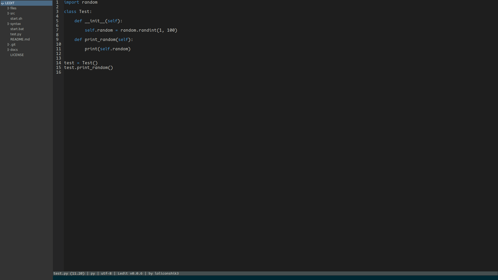
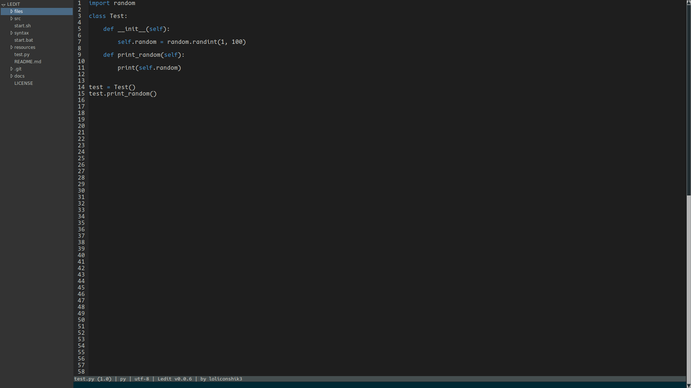
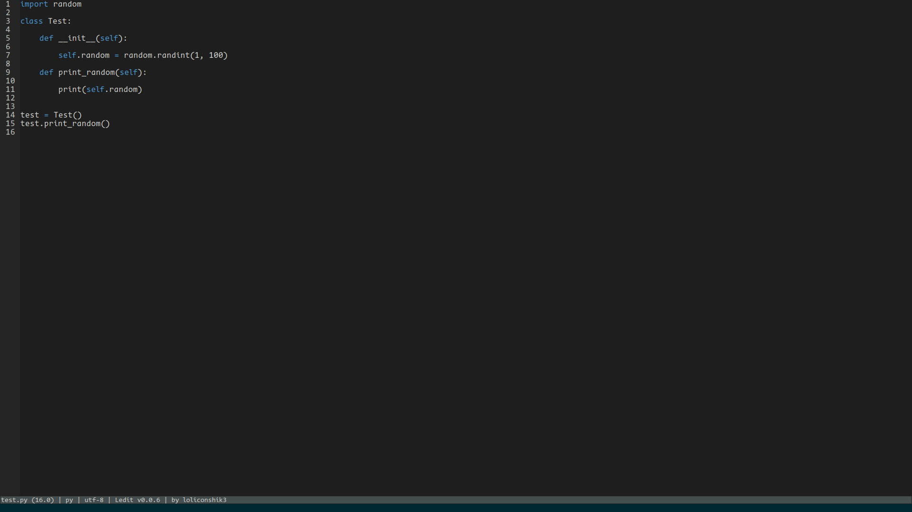

<h1 align="center">ledit</h1>

**Ledit** - Simple, minimalist code editor, who works only with key bindings.

Here is a ledit interface:

 

# Features 

* Full and simple customization

* Syntax highlight

* Simple creating of syntax files

* Minimalist design

* All text editor functions

# Documentation

* [Key-bindings](./docs/keybindings.md)

* [Commands](./docs/commands.md)

* [Syntax](./docs/syntax.md)